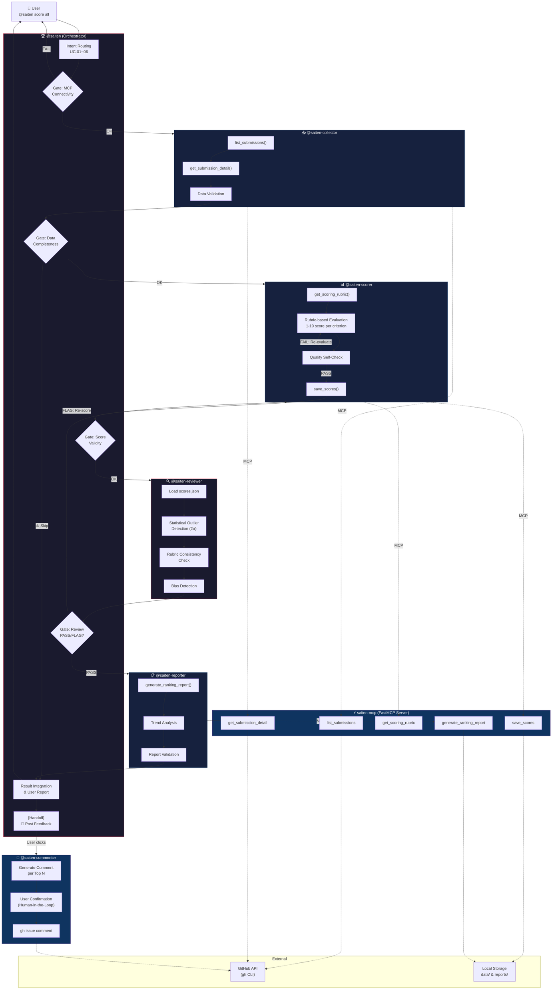

# Saiten — Agents League @ TechConnect Scoring Agent

> **Submission Track**: 🎨 Creative Apps — GitHub Copilot

## Overview

A multi-agent system that automatically scores all Agents League @ TechConnect hackathon submissions and generates ranking reports — just type `@saiten score all` in VS Code.

Designed with **Orchestrator-Workers + Prompt Chaining + Evaluator-Optimizer** patterns, 6 Copilot custom agents autonomously collect GitHub Issue submissions, evaluate them against track-specific rubrics, validate scoring consistency, and generate reports via an MCP (Model Context Protocol) server.

---

## Agent Workflow

### Design Patterns

- **Orchestrator-Workers**: `@saiten` delegates to 5 specialized sub-agents
- **Prompt Chaining**: Collect → Score → Review → Report with Gates at each step
- **Evaluator-Optimizer**: Reviewer validates scores, triggers re-scoring on FLAG
- **Handoff**: Commenter posts feedback only after explicit user confirmation
- **SRP (Single Responsibility Principle)**: 1 agent = 1 responsibility

### Workflow Diagram



### Agent Roster

| Agent | Role | SRP Responsibility | MCP Tools |
|-------|------|--------------------|-----------|
| 🏆 `@saiten` | **Orchestrator** | Intent routing, delegation, result integration | — (delegates all) |
| 📥 `@saiten-collector` | **Worker** | GitHub Issue data collection & validation | `list_submissions`, `get_submission_detail` |
| 📊 `@saiten-scorer` | **Worker** | Rubric-based evaluation with quality gate | `get_scoring_rubric`, `save_scores` |
| 🔍 `@saiten-reviewer` | **Evaluator** | Score consistency review & bias detection | `get_scoring_rubric`, read scores |
| 📋 `@saiten-reporter` | **Worker** | Ranking report generation & trend analysis | `generate_ranking_report` |
| 💬 `@saiten-commenter` | **Handoff** | GitHub Issue feedback comments (user-confirmed) | `gh issue comment` |

### Design Principles Applied

| Principle | How Applied |
|-----------|-------------|
| **SRP** | Each agent handles exactly 1 responsibility (6 agents × 1 duty) |
| **Fail Fast** | Gates at every step; anomalies reported immediately |
| **SSOT** | All score data centralized in `data/scores.json` |
| **Feedback Loop** | Scorer → Reviewer → Re-score loop (Evaluator-Optimizer pattern) |
| **Human-in-the-Loop** | Commenter runs only after explicit user confirmation via Handoff |
| **Transparency** | Todo list shows progress; each Gate reports status |
| **Idempotency** | Re-scoring overwrites; safe to run multiple times |
| **ISP** | Each sub-agent receives only the tools and data it needs |

---

## System Architecture

```
┌─────────────────────────────────────────────────────────┐
│  VS Code                                                 │
│                                                          │
│  ┌────────────────────────────────────────────────────┐  │
│  │ 🏆 @saiten (Orchestrator Agent)                    │  │
│  │    ├── 📥 @saiten-collector (Worker)               │  │
│  │    ├── 📊 @saiten-scorer   (Worker)                │  │
│  │    ├── 🔍 @saiten-reviewer (Evaluator)             │  │
│  │    ├── 📋 @saiten-reporter (Worker)                │  │
│  │    └── 💬 @saiten-commenter (Handoff)              │  │
│  └──────────────┬─────────────────────────────────────┘  │
│                 │ MCP (stdio)                             │
│  ┌──────────────▼─────────────────────────────────────┐  │
│  │ ⚡ saiten-mcp (FastMCP Server / Python)             │  │
│  │  ├ list_submissions()     ← gh CLI → GitHub        │  │
│  │  ├ get_submission_detail() ← gh CLI → GitHub       │  │
│  │  ├ get_scoring_rubric()   ← YAML files             │  │
│  │  ├ save_scores()          → data/scores.json       │  │
│  │  └ generate_ranking_report() → reports/*.md        │  │
│  └────────────────────────────────────────────────────┘  │
└─────────────────────────────────────────────────────────┘
```

---

## Setup

### Prerequisites

- Python 3.10+
- [uv](https://docs.astral.sh/uv/) (package manager)
- [gh CLI](https://cli.github.com/) (GitHub CLI, authenticated)
- VS Code + GitHub Copilot

### Installation

```bash
# Clone the repository
git clone <repo-url>
cd FY26_techconnect_saiten

# Create Python virtual environment
uv venv
source .venv/bin/activate  # Windows: .venv\Scripts\activate

# Install dependencies
uv pip install -e .

# Verify gh CLI authentication
gh auth status
```

### VS Code Configuration

`.vscode/mcp.json` automatically configures the MCP server. No additional setup required.

---

## Usage

Type the following in the VS Code chat panel:

| Command | Description | Agents Used |
|---------|-------------|-------------|
| `@saiten score all` | Score all submissions | collector → scorer → reviewer → reporter |
| `@saiten score #48` | Score a single submission | collector → scorer → reviewer → reporter |
| `@saiten ranking` | Generate ranking report | reporter only |
| `@saiten rescore #48` | Re-score a submission | collector → scorer → reviewer → reporter |
| `@saiten show rubric for Creative` | Display scoring rubric | Direct response (MCP) |
| `@saiten review scores` | Review score consistency | reviewer only |

---

## Project Structure

```
FY26_techconnect_saiten/
├── .github/agents/
│   ├── saiten.agent.md               # 🏆 Orchestrator
│   ├── saiten-collector.agent.md     # 📥 Data Collection Worker
│   ├── saiten-scorer.agent.md        # 📊 Scoring Worker
│   ├── saiten-reviewer.agent.md      # 🔍 Score Reviewer (Evaluator)
│   ├── saiten-reporter.agent.md      # 📋 Report Worker
│   └── saiten-commenter.agent.md     # 💬 Feedback Commenter (Handoff)
├── src/saiten_mcp/
│   ├── server.py                     # MCP Server entrypoint
│   ├── models.py                     # Pydantic data models
│   └── tools/
│       ├── submissions.py            # list_submissions, get_submission_detail
│       ├── rubrics.py                # get_scoring_rubric
│       ├── scores.py                 # save_scores
│       └── reports.py                # generate_ranking_report
├── data/
│   ├── rubrics/                      # Track-specific scoring rubrics (YAML)
│   └── scores.json                   # Scoring results (SSOT)
├── reports/
│   └── ranking.md                    # Auto-generated ranking report
├── scripts/
│   └── run_scoring.py                # CLI scoring pipeline
├── tests/
│   └── test_e2e.py                   # E2E test suite
├── .vscode/mcp.json                  # MCP server config
├── AGENTS.md                         # Agent registry
└── pyproject.toml
```

---

## Scoring Tracks

| Track | Criteria | Notes |
|-------|----------|-------|
| 🎨 Creative Apps | 5 criteria | Community Vote (10%) excluded; remaining 90% prorated to 100% |
| 🧠 Reasoning Agents | 5 criteria | Uses common overall criteria |
| 💼 Enterprise Agents | 3 criteria | Custom 3-axis evaluation |

---

## Tech Stack

| Layer | Technology |
|-------|-----------|
| **Agent Framework** | VS Code Copilot Custom Agent (`.agent.md`) — Orchestrator-Workers pattern |
| **MCP Server** | Python 3.10+ / FastMCP (stdio transport) |
| **Package Manager** | uv |
| **GitHub Integration** | gh CLI / GitHub REST API |
| **Data Models** | Pydantic v2 |
| **Data Storage** | JSON (scores) / YAML (rubrics) / Markdown (reports) |

---

## License

MIT
