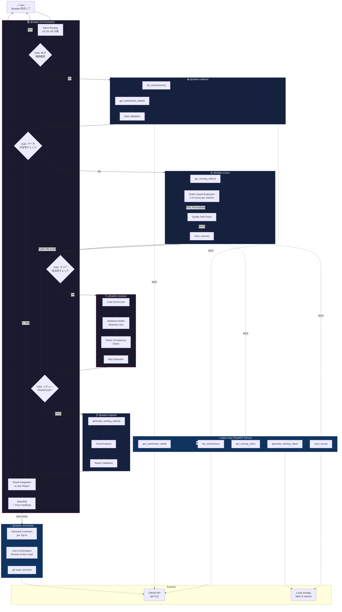

# Saiten — Agents League @ TechConnect 採点エージェント

> **提出トラック**: 🎨 Creative Apps — GitHub Copilot

## 概要

VS Code 上で `@saiten 採点して` と入力するだけで、Agents League @ TechConnect ハッカソンの全提出物を自動採点し、ランキングを生成するマルチエージェントシステムです。

**Orchestrator-Workers + Prompt Chaining** パターンで設計された 4 つの Copilot カスタムエージェントが、MCP (Model Context Protocol) サーバーを介して GitHub Issue の収集・評価・レポート生成を自律的に実行します。

---

## エージェントワークフロー

### 設計パターン

- **Orchestrator-Workers**: `@saiten` が 3 つの専門サブエージェントに委譲
- **Prompt Chaining**: Collect → Score → Report の順次実行（各ステップに Gate）
- **SRP (Single Responsibility Principle)**: 1 エージェント = 1 責務

### ワークフロー図



### エージェント一覧

| Agent | Role | SRP Responsibility | MCP Tools |
|-------|------|--------------------|-----------|
| 🏆 `@saiten` | **Orchestrator** | Intent routing, delegation, result integration | — (delegates all) |
| 📥 `@saiten-collector` | **Worker** | GitHub Issue data collection & validation | `list_submissions`, `get_submission_detail` |
| 📊 `@saiten-scorer` | **Worker** | Rubric-based evaluation with quality gate | `get_scoring_rubric`, `save_scores` |
| 🔍 `@saiten-reviewer` | **Evaluator** | Score consistency review & bias detection | `get_scoring_rubric`, read scores |
| 📋 `@saiten-reporter` | **Worker** | Ranking report generation & trend analysis | `generate_ranking_report` |
| 💬 `@saiten-commenter` | **Handoff** | GitHub Issue feedback comments (user-confirmed) | `gh issue comment` |

### 設計原則の適用

| Principle | How Applied |
|-----------|-------------|
| **SRP** | 各エージェントが 1 つの責務のみ担当（6 エージェント × 1 責務） |
| **Fail Fast** | 各ステップに Gate を設置、異常時は即座に報告 |
| **SSOT** | スコアデータは `data/scores.json` に一元管理 |
| **Feedback Loop** | Scorer → Reviewer → Re-score ループ（Evaluator-Optimizer パターン） |
| **Human-in-the-Loop** | Commenter は Handoff で明示的なユーザー承認後に実行 |
| **Transparency** | Todo リストで進捗表示、各 Gate で状況報告 |
| **Idempotency** | 再採点は上書き方式、何度実行しても安全 |
| **ISP** | 各サブエージェントに必要なツール・データのみ渡す |

---

## システムアーキテクチャ

```
┌─────────────────────────────────────────────────────────┐
│  VS Code                                                 │
│                                                          │
│  ┌────────────────────────────────────────────────────┐  │
│  │ 🏆 @saiten (Orchestrator Agent)                    │  │
│  │    ├── 📥 @saiten-collector (Worker)               │  │
│  │    ├── 📊 @saiten-scorer   (Worker)                │  │
│  │    ├── 🔍 @saiten-reviewer (Evaluator)             │  │
│  │    ├── 📋 @saiten-reporter (Worker)                │  │
│  │    └── 💬 @saiten-commenter (Handoff)              │  │
│  └──────────────┬─────────────────────────────────────┘  │
│                 │ MCP (stdio)                             │
│  ┌──────────────▼─────────────────────────────────────┐  │
│  │ ⚡ saiten-mcp (FastMCP Server / Python)             │  │
│  │  ├ list_submissions()     ← gh CLI → GitHub        │  │
│  │  ├ get_submission_detail() ← gh CLI → GitHub       │  │
│  │  ├ get_scoring_rubric()   ← YAML files             │  │
│  │  ├ save_scores()          → data/scores.json       │  │
│  │  └ generate_ranking_report() → reports/*.md        │  │
│  └────────────────────────────────────────────────────┘  │
└─────────────────────────────────────────────────────────┘
```

---

## セットアップ

### 前提条件

- Python 3.10+
- [uv](https://docs.astral.sh/uv/) (パッケージマネージャー)
- [gh CLI](https://cli.github.com/) (GitHub CLI、認証済み)
- VS Code + GitHub Copilot

### インストール

```bash
# リポジトリをクローン
git clone <repo-url>
cd FY26_techconnect_saiten

# Python 仮想環境を作成
uv venv
source .venv/bin/activate  # Windows: .venv\Scripts\activate

# 依存パッケージをインストール
uv pip install -e .

# gh CLI の認証確認
gh auth status
```

### VS Code 設定

`.vscode/mcp.json` が自動で MCP サーバーを設定します。追加設定は不要です。

---

## 使い方

VS Code のチャットパネルで以下のように入力します:

| コマンド                          | 説明                     | 使用エージェント |
| --------------------------------- | ------------------------ | ---------------- |
| `@saiten 採点して`                | 全提出物を一括採点       | collector → scorer → reporter |
| `@saiten #48 を採点して`          | 個別提出物を採点         | collector → scorer → reporter |
| `@saiten ランキング出して`        | ランキングレポートを生成 | reporter のみ |
| `@saiten #48 を再採点して`        | 個別提出物を再採点       | collector → scorer → reporter |
| `@saiten Creative の採点基準は？` | 採点基準を表示           | 直接応答 (MCP) |

---

## プロジェクト構成

```
FY26_techconnect_saiten/
├── .github/agents/
│   ├── saiten.agent.md               # 🏆 Orchestrator
│   ├── saiten-collector.agent.md     # 📥 Data Collection Worker
│   ├── saiten-scorer.agent.md        # 📊 Scoring Worker
│   ├── saiten-reviewer.agent.md      # 🔍 Score Reviewer (Evaluator)
│   ├── saiten-reporter.agent.md      # 📋 Report Worker
│   └── saiten-commenter.agent.md     # 💬 Feedback Commenter (Handoff)
├── src/saiten_mcp/
│   ├── server.py                     # MCP Server entrypoint
│   ├── models.py                     # Pydantic data models
│   └── tools/
│       ├── submissions.py            # list_submissions, get_submission_detail
│       ├── rubrics.py                # get_scoring_rubric
│       ├── scores.py                 # save_scores
│       └── reports.py                # generate_ranking_report
├── data/
│   ├── rubrics/                      # Track-specific scoring rubrics (YAML)
│   └── scores.json                   # Scoring results (SSOT)
├── reports/
│   └── ranking.md                    # Auto-generated ranking report
├── scripts/
│   └── run_scoring.py                # CLI scoring pipeline
├── tests/
│   └── test_e2e.py                   # E2E test suite
├── .vscode/mcp.json                  # MCP server config
├── AGENTS.md                         # Agent registry
└── pyproject.toml
```

---

## 採点トラック

| トラック             | 基準数 | 特記                              |
| -------------------- | ------ | --------------------------------- |
| 🎨 Creative Apps     | 5 基準 | Community Vote (10%) を除外し按分 |
| 🧠 Reasoning Agents  | 5 基準 | 全体共通基準を採用                |
| 💼 Enterprise Agents | 3 基準 | 独自の 3 軸評価                   |

---

## 技術スタック

| Layer | Technology |
|-------|-----------|
| **Agent Framework** | VS Code Copilot Custom Agent (`.agent.md`) — Orchestrator-Workers pattern |
| **MCP Server** | Python 3.10+ / FastMCP (stdio transport) |
| **Package Manager** | uv |
| **GitHub Integration** | gh CLI / GitHub REST API |
| **Data Models** | Pydantic v2 |
| **Data Storage** | JSON (scores) / YAML (rubrics) / Markdown (reports) |

---

## ライセンス

MIT
