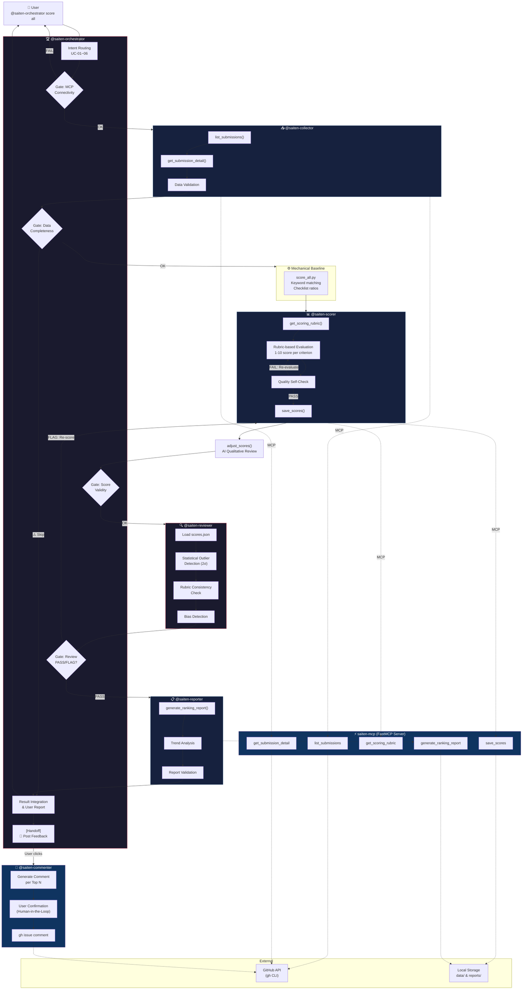

# Saiten — Agents League @ TechConnect Scoring Agent

> **Submission Track**: 🎨 Creative Apps — GitHub Copilot

## Overview

A multi-agent system that automatically scores all Agents League @ TechConnect hackathon submissions and generates ranking reports — just type `@saiten-orchestrator score all` in VS Code.

Designed with **Orchestrator-Workers + Prompt Chaining + Evaluator-Optimizer** patterns, 6 Copilot custom agents autonomously collect GitHub Issue submissions, evaluate them against track-specific rubrics, validate scoring consistency, and generate reports via an MCP (Model Context Protocol) server.

### Two-Phase Scoring

Scoring uses a **mechanical baseline + AI qualitative review** pipeline:

| Phase                  | What                   | How                                                                                                | Judges                                                                                        |
| ---------------------- | ---------------------- | -------------------------------------------------------------------------------------------------- | --------------------------------------------------------------------------------------------- |
| **Phase A: Baseline**  | `scripts/score_all.py` | Keyword matching, checklist ratios, README section counts, demo detection                          | "Does the README mention MCP?" "How many checklist items are checked?"                        |
| **Phase B: AI Review** | `@saiten-scorer` agent | Copilot reads each submission, assesses quality holistically, adjusts scores via `adjust_scores()` | "Is this genuinely novel or a tutorial wrapper?" "Does implementation depth match the score?" |

The baseline is fast and deterministic but shallow. The AI review adds the qualitative depth that only comes from actually reading and understanding each project.

---

## Agent Workflow

### Design Patterns

- **Orchestrator-Workers**: `@saiten-orchestrator` delegates to 5 specialized sub-agents
- **Prompt Chaining**: Collect → Score → Review → Report with Gates at each step
- **Evaluator-Optimizer**: Reviewer validates scores, triggers re-scoring on FLAG
- **Handoff**: Commenter posts feedback only after explicit user confirmation
- **SRP (Single Responsibility Principle)**: 1 agent = 1 responsibility

### Reasoning Patterns

- **Chain-of-Thought (CoT)**: Scorer evaluates each criterion sequentially, building evidence chain before calculating weighted total
- **Evaluator-Optimizer Loop**: Reviewer detects 5 bias types (central tendency, halo effect, leniency, range restriction, anchoring) → FLAGs → Scorer re-evaluates with specific guidance → max 2 cycles
- **Gate-based Error Recovery**: Each workflow step has a validation gate; failures trigger graceful degradation (skip + warn) rather than hard stops
- **Evidence-Anchored Scoring**: Rubrics define explicit `evidence_signals` (positive/negative) per criterion; scorers must cite signals from actual submission content
- **Two-Phase Scoring**: Mechanical baseline extracts signals deterministically; Copilot agent then reviews qualitatively and adjusts scores with rationale via `adjust_scores()`

### Reliability Features

- **Exponential Backoff Retry**: gh CLI calls retry up to 3 times on rate limits (429) and server errors (5xx) with exponential delay
- **Rate Limiting**: Sliding-window rate limiter (30 calls/60s per tool) prevents GitHub API abuse
- **Input Validation**: All MCP tool inputs validated at boundaries (Fail Fast) — scores 1-10, weighted_total 0-100, required fields checked
- **Corrupted Data Recovery**: `scores.json` auto-backed up on parse failure, server continues with empty store
- **Idempotent Operations**: Re-scoring safely overwrites existing entries by `issue_number` key

### Workflow Diagram



### Agent Roster

| Agent                     | Role             | SRP Responsibility                                          | MCP Tools                                            |
| ------------------------- | ---------------- | ----------------------------------------------------------- | ---------------------------------------------------- |
| 🏆 `@saiten-orchestrator` | **Orchestrator** | Intent routing, delegation, result integration              | — (delegates all)                                    |
| 📥 `@saiten-collector`    | **Worker**       | GitHub Issue data collection & validation                   | `list_submissions`, `get_submission_detail`          |
| 📊 `@saiten-scorer`       | **Worker**       | Two-phase scoring: baseline signals + AI qualitative review | `get_scoring_rubric`, `save_scores`, `adjust_scores` |
| 🔍 `@saiten-reviewer`     | **Evaluator**    | Score consistency review & bias detection                   | `get_scoring_rubric`, read scores                    |
| 📋 `@saiten-reporter`     | **Worker**       | Ranking report generation & trend analysis                  | `generate_ranking_report`                            |
| 💬 `@saiten-commenter`    | **Handoff**      | GitHub Issue feedback comments (user-confirmed)             | `gh issue comment`                                   |

### Design Principles Applied

| Principle             | How Applied                                                      |
| --------------------- | ---------------------------------------------------------------- |
| **SRP**               | Each agent handles exactly 1 responsibility (6 agents × 1 duty)  |
| **Fail Fast**         | Gates at every step; anomalies reported immediately              |
| **SSOT**              | All score data centralized in `data/scores.json`                 |
| **Feedback Loop**     | Scorer → Reviewer → Re-score loop (Evaluator-Optimizer pattern)  |
| **Human-in-the-Loop** | Commenter runs only after explicit user confirmation via Handoff |
| **Transparency**      | Todo list shows progress; each Gate reports status               |
| **Idempotency**       | Re-scoring overwrites; safe to run multiple times                |
| **ISP**               | Each sub-agent receives only the tools and data it needs         |

---

## System Architecture

```
┌─────────────────────────────────────────────────────────┐
│  VS Code                                                 │
│                                                          │
│  ┌────────────────────────────────────────────────────┐  │
│  │ 🏆 @saiten-orchestrator                          │  │
│  │    ├── 📥 @saiten-collector (Worker)               │  │
│  │    ├── 📊 @saiten-scorer   (Worker)                │  │
│  │    ├── 🔍 @saiten-reviewer (Evaluator)             │  │
│  │    ├── 📋 @saiten-reporter (Worker)                │  │
│  │    └── 💬 @saiten-commenter (Handoff)              │  │
│  └──────────────┬─────────────────────────────────────┘  │
│                 │ MCP (stdio)                             │
│  ┌──────────────▼─────────────────────────────────────┐  │
│  │ ⚡ saiten-mcp (FastMCP Server / Python)             │  │
│  │  ├ list_submissions()     ← gh CLI → GitHub        │  │
│  │  ├ get_submission_detail() ← gh CLI → GitHub       │  │
│  │  ├ get_scoring_rubric()   ← YAML files             │  │
│  │  ├ save_scores()          → data/scores.json       │  │
│  │  ├ adjust_scores()        → data/scores.json       │  │
│  │  └ generate_ranking_report() → reports/*.md        │  │
│  └────────────────────────────────────────────────────┘  │
└─────────────────────────────────────────────────────────┘
```

---

## Setup

### Prerequisites

- Python 3.10+
- [uv](https://docs.astral.sh/uv/) (package manager)
- [gh CLI](https://cli.github.com/) (GitHub CLI, authenticated)
- VS Code + GitHub Copilot

### Installation

```bash
# Clone the repository
git clone <repo-url>
cd FY26_techconnect_saiten

# Create Python virtual environment
uv venv
source .venv/bin/activate  # Windows: .venv\Scripts\activate

# Install dependencies (production)
uv pip install -e .

# Install development dependencies (includes pytest + coverage)
uv pip install -e ".[dev]"

# Verify gh CLI authentication
gh auth status
```

### Environment Variables

No secrets are required for normal operation.

```bash
# Copy the template (optional — only needed for CI or non-VS Code environments)
cp .env.example .env
```

| Variable       | Required | Description                                               |
| -------------- | -------- | --------------------------------------------------------- |
| `GITHUB_TOKEN` | No       | gh CLI manages its own auth. Only set for CI environments |

> **Security**: This project uses `gh CLI` authentication and VS Code Copilot's built-in Azure OpenAI credentials. No API keys are stored in code or config files.

### VS Code Configuration

`.vscode/mcp.json` automatically configures the MCP server. No additional setup required.

---

## Usage

Type the following in the VS Code chat panel:

| Command                                         | Description               | Agents Used                                              |
| ----------------------------------------------- | ------------------------- | -------------------------------------------------------- |
| `@saiten-orchestrator score all`                | Score all submissions     | collector → baseline → scorer (AI) → reviewer → reporter |
| `@saiten-orchestrator score #48`                | Score a single submission | collector → scorer → reviewer → reporter                 |
| `@saiten-orchestrator ranking`                  | Generate ranking report   | reporter only                                            |
| `@saiten-orchestrator rescore #48`              | Re-score a submission     | collector → scorer → reviewer → reporter                 |
| `@saiten-orchestrator show rubric for Creative` | Display scoring rubric    | Direct response (MCP)                                    |
| `@saiten-orchestrator review scores`            | Review score consistency  | reviewer only                                            |

---

## Project Structure

```
FY26_techconnect_saiten/
├── .github/agents/
│   ├── saiten-orchestrator.agent.md  # 🏆 Orchestrator
│   ├── saiten-collector.agent.md     # 📥 Data Collection Worker
│   ├── saiten-scorer.agent.md        # 📊 Scoring Worker
│   ├── saiten-reviewer.agent.md      # 🔍 Score Reviewer (Evaluator)
│   ├── saiten-reporter.agent.md      # 📋 Report Worker
│   └── saiten-commenter.agent.md     # 💬 Feedback Commenter (Handoff)
├── src/saiten_mcp/
│   ├── server.py                     # MCP Server + rate limiter + structured logging
│   ├── models.py                     # Pydantic data models with boundary validation
│   └── tools/
│       ├── submissions.py            # list_submissions, get_submission_detail
│       ├── rubrics.py                # get_scoring_rubric
│       ├── scores.py                 # save_scores, adjust_scores
│       └── reports.py                # generate_ranking_report
├── data/
│   ├── rubrics/                      # Track-specific scoring rubrics (YAML)
│   └── scores.json                   # Scoring results (SSOT)
├── reports/
│   └── ranking.md                    # Auto-generated ranking report
├── scripts/
│   ├── score_all.py                  # Phase A: Mechanical baseline scoring
│   └── run_scoring.py                # CLI scoring pipeline (legacy)
├── tests/
│   ├── conftest.py                   # Shared test fixtures
│   ├── test_models.py                # Pydantic model validation tests
│   ├── test_parsers.py               # Issue body parser tests
│   ├── test_rubrics.py               # Rubric YAML integrity tests
│   ├── test_scores.py                # Score persistence & validation tests
│   ├── test_reports.py               # Report generation tests
│   ├── test_reliability.py           # Retry, rate limiting, error handling tests
│   └── test_e2e.py                   # E2E integration tests
├── .vscode/mcp.json                  # MCP server config
├── AGENTS.md                         # Agent registry
└── pyproject.toml
```

---

## Testing

The project has a comprehensive test suite with **110 tests** covering models, parsers, tools, reliability, and reports.

```bash
# Run all tests
python -m pytest tests/ -v

# Run with coverage report
python -m pytest tests/ --cov=saiten_mcp --cov-report=term-missing

# Run only unit tests (no network calls)
python -m pytest tests/ -m "not e2e" -v

# Run integration tests (requires gh CLI auth)
python -m pytest tests/ -m e2e -v
```

### Test Structure

| Test File             | Tests   | What It Covers                                                   |
| --------------------- | ------- | ---------------------------------------------------------------- |
| `test_models.py`      | 17      | Pydantic models, validation boundaries, evidence-anchored fields |
| `test_parsers.py`     | 28      | Issue body parsing, track detection, URL extraction, checklists  |
| `test_rubrics.py`     | 20      | Rubric YAML integrity, weights, scoring policy, evidence signals |
| `test_scores.py`      | 9       | Score persistence, idempotency, input validation, sorting        |
| `test_reports.py`     | 8       | Markdown report generation, empty/missing data edge cases        |
| `test_reliability.py` | 10      | Retry logic, rate limiting, error handling, gh CLI resilience    |
| `test_e2e.py`         | 5       | End-to-end MCP tool calls with live GitHub data                  |
| **Total**             | **110** | **88% code coverage**                                            |

---

## Scoring Tracks

| Track                | Criteria   | Notes                                                         |
| -------------------- | ---------- | ------------------------------------------------------------- |
| 🎨 Creative Apps     | 5 criteria | Community Vote (10%) excluded; remaining 90% prorated to 100% |
| 🧠 Reasoning Agents  | 5 criteria | Uses common overall criteria                                  |
| 💼 Enterprise Agents | 3 criteria | Custom 3-axis evaluation                                      |

---

## Demo

The multi-agent workflow can be invoked directly from VS Code's chat panel:

### Scoring a Single Submission

```
👤 User: @saiten-orchestrator score #49

🏆 @saiten-orchestrator → Routes to collector → scorer → reviewer → reporter

📥 @saiten-collector: Fetched Issue #49 (EasyExpenseAI)
   ├─ Track: Creative Apps
   ├─ Repo: github.com/chakras/Easy-Expense-AI
   ├─ README: 10,036 chars extracted
   └─ Gate: ✅ Data complete

📊 @saiten-scorer: Evidence-anchored evaluation
   ├─ Accuracy & Relevance: 8/10
   │   Evidence: "5-agent Semantic Kernel pipeline with Azure Document Intelligence"
   ├─ Reasoning: 7/10
   │   Evidence: "Linear pipeline, no self-correction loop"
   ├─ Total: 73.9/100
   └─ Gate: ✅ All criteria scored with evidence

🔍 @saiten-reviewer: Bias check passed
   ├─ Outlier check: PASS (within 2σ)
   ├─ Evidence quality: PASS (no generic phrases)
   └─ Gate: ✅ PASS

📋 @saiten-reporter: Report saved → reports/ranking.md
```

### Scoring All Submissions

```
👤 User: @saiten-orchestrator score all

🏆 @saiten-orchestrator: Processing 43 submissions across 3 tracks...
   ├─ 📥 Collecting → 📊 Scoring → 🔍 Reviewing → 📋 Reporting
   ├─ Progress tracked via Todo list
   └─ Final report: reports/ranking.md
```

### Key Differentiators

- **Evidence-anchored scoring**: Each criterion requires specific evidence from the submission, not generic phrases
- **Self-correction loop**: Reviewer FLAGs biased scores → Scorer re-evaluates → until PASS
- **Real-time progress**: Todo list updates visible in VS Code during multi-submission scoring
- **Human-in-the-loop**: Feedback comments only posted after explicit user confirmation via Handoff

---

## Troubleshooting

| Issue                                       | Cause                      | Solution                                                                                |
| ------------------------------------------- | -------------------------- | --------------------------------------------------------------------------------------- |
| `gh command failed`                         | gh CLI not authenticated   | Run `gh auth login`                                                                     |
| `scores.json corrupted`                     | Interrupted write          | Auto-restored from `.json.bak` backup                                                   |
| `ValueError: issue_number must be positive` | Bad input to `save_scores` | Check score data format matches schema                                                  |
| `Invalid track name`                        | Typo in track parameter    | Use: `creative-apps`, `reasoning-agents`, or `enterprise-agents`                        |
| MCP server not starting                     | Python env mismatch        | Ensure `uv pip install -e .` in the `.venv`                                             |
| No submissions returned                     | Network or auth issue      | Run `gh api repos/microsoft/agentsleague-techconnect/issues --jq '.[0].number'` to test |

### Corrupted Data Recovery

If `data/scores.json` becomes corrupted, the server automatically:

1. Logs a warning with the parse error
2. Creates a backup at `data/scores.json.bak`
3. Continues with an empty score store

To restore manually:

```bash
cp data/scores.json.bak data/scores.json
```

---

## Tech Stack

| Layer                  | Technology                                                                        |
| ---------------------- | --------------------------------------------------------------------------------- |
| **Agent Framework**    | VS Code Copilot Custom Agent (`.agent.md`) — Orchestrator-Workers pattern         |
| **MCP Server**         | Python 3.10+ / FastMCP (stdio transport)                                          |
| **Package Manager**    | uv                                                                                |
| **GitHub Integration** | gh CLI / GitHub REST API with **exponential backoff retry** and **rate limiting** |
| **Data Models**        | Pydantic v2 with **boundary validation** (scores 1-10, weighted_total 0-100)      |
| **Data Storage**       | JSON (scores) / YAML (rubrics) / Markdown (reports) with **backup & recovery**    |
| **Testing**            | pytest + pytest-cov — **110 tests, 88% coverage**                                 |
| **Error Handling**     | Retry with backoff, rate limiting, input validation, corrupted file recovery      |

---

## License

MIT
