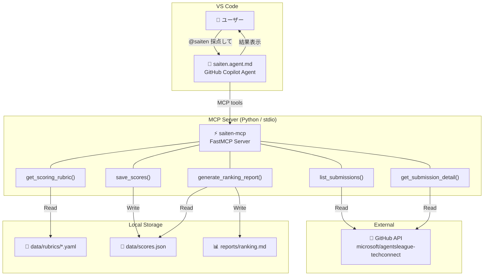

# Saiten — 基本設計書
> **プロジェクト**: Agents League @ TechConnect 採点エージェント
> **バージョン**: 1.0
> **作成日**: 2026-02-13
> **提出トラック**: 🎨 Creative Apps — GitHub Copilot

---

## 1. プロジェクト概要

### 1.1 背景

Agents League @ TechConnect は Microsoft 社員向けの AI エージェント ハッカソンであり、約 42 件の提出物が GitHub Issue として提出される。現状、審査は人手で行われるため、一貫性のある評価が困難である。

### 1.2 目的

GitHub Copilot のカスタムエージェント機能 + MCP (Model Context Protocol) サーバーを組み合わせ、VS Code 上で `@saiten 採点して` と入力するだけで全提出物を自動採点し、ランキングを生成するシステムを構築する。

### 1.3 スコープ

| 対象 | 内容 |
|------|------|
| ✅ In Scope | GitHub Issue の自動取得・パース、トラック別基準での採点、ランキング生成、レポート出力 |
| ✅ In Scope | MCP サーバーによる Read/Write 統合 |
| ✅ In Scope | 個別再採点・ランキング更新 |
| ❌ Out of Scope | Community Vote (Discord 連携)、コード実行・ビルド検証、画像/動画の内容評価 |

---

## 2. システムアーキテクチャ

### 2.1 全体構成図

### 2.2 コンポーネント一覧

| コンポーネント | 種別 | 責務 |
|----------------|------|------|
| **saiten.agent.md** | Copilot Agent | ユーザーインターフェース。指示受付→MCP呼出→結果整形 |
| **saiten-mcp** | MCP Server | データ取得・永続化・レポート生成のツール群を提供 |
| **GitHub API** | 外部 API | 提出物 Issue の取得元 |
| **data/rubrics/** | 設定ファイル | トラック別採点基準 (YAML) |
| **data/scores.json** | データストア | 採点結果の永続ストレージ |
| **reports/ranking.md** | 出力 | 自動生成されるランキングレポート |

### 2.3 技術スタック

| 層 | 技術 | 理由 |
|----|------|------|
| Agent | VS Code Copilot Custom Agent (.agent.md) | 必須要件: GitHub Copilot 活用 |
| MCP Server | Python 3.10+ / FastMCP | 必須要件: MCP 統合 |
| パッケージ管理 | uv | ワークスペースルール準拠 |
| GitHub 連携 | gh CLI / GitHub REST API | Issue データのRead |
| データ形式 | JSON (スコア) / YAML (基準) / Markdown (レポート) | 人間可読 + 機械処理可能 |
| (Optional) クラウド | Azure Container Apps | リモート MCP ホスティング |

---

## 3. 機能要件

### 3.1 ユースケース一覧

| UC-ID | ユースケース | アクター | トリガー |
|-------|-------------|---------|---------|
| UC-01 | 全提出物の一括採点 | ユーザー | `@saiten 全件採点して` |
| UC-02 | 個別提出物の採点 | ユーザー | `@saiten #48 を採点して` |
| UC-03 | ランキング生成 | ユーザー | `@saiten ランキング出して` |
| UC-04 | 再採点 + ランキング更新 | ユーザー | `@saiten #48 を再採点して` |
| UC-05 | 採点基準の確認 | ユーザー | `@saiten Creative の採点基準は？` |

### 3.2 UC-01: 全提出物の一括採点 (メインフロー)

`
1. ユーザーが @saiten に採点指示
2. Agent → MCP: list_submissions() で全 Issue 取得
3. Agent → MCP: get_scoring_rubric(track) でトラック別基準取得
4. 各提出物について:
   a. Agent → MCP: get_submission_detail(issue_number)
   b. Agent が LLM 推論で採点 (基準×スコア)
   c. Agent → MCP: save_scores(results)
5. Agent → MCP: generate_ranking_report()
6. Agent がユーザーに Top 10 サマリーを表示
`

---

## 4. 非機能要件

| 項目 | 要件 |
|------|------|
| **信頼性** | Fail Fast: Issue パース失敗時は該当件をスキップし、他の採点を継続。エラー件数をレポート |
| **安全性** | PII フィルタリング、API キーのハードコード禁止、scores.json に個人情報を含めない |
| **冪等性** | 同一 Issue を複数回採点しても結果が壊れない（上書き方式） |
| **拡張性** | 採点基準は YAML ファイルで外出し。トラック追加時はファイル追加のみ |
| **パフォーマンス** | 42件の一括採点に対応（逐次処理、タイムアウトなし） |

---

## 5. ファイル構成

`
FY26_techconnect_saiten/
├── .github/
│   └── agents/
│       └── saiten.agent.md           # Copilot カスタムエージェント
├── src/
│   └── saiten_mcp/
│       ├── __init__.py
│       ├── server.py                 # MCP Server エントリーポイント
│       ├── tools/
│       │   ├── __init__.py
│       │   ├── submissions.py        # list_submissions, get_submission_detail
│       │   ├── rubrics.py            # get_scoring_rubric
│       │   ├── scores.py             # save_scores
│       │   └── reports.py            # generate_ranking_report
│       └── models.py                 # データモデル (Pydantic)
├── data/
│   ├── rubrics/
│   │   ├── creative-apps.yaml
│   │   ├── reasoning-agents.yaml
│   │   └── enterprise-agents.yaml
│   └── scores.json
├── reports/
│   └── ranking.md
├── infra/                            # (Optional) Azure デプロイ
│   ├── Dockerfile
│   └── deploy.sh
├── .vscode/
│   └── mcp.json
├── docs/
│   ├── design/
│   │   ├── basic-design.md           # 基本設計書 (本書)
│   │   └── detailed-design.md        # 詳細設計書
│   └── AgentsLeague_TechConnect_Info.md
├── pyproject.toml
└── README.md
`

---

## 6. 採点基準設計

### 6.1 全体共通基準 (docs より)

| 基準 | 重み |
|------|------|
| Accuracy & Relevance | 25% |
| Reasoning & Multi-step Thinking | 25% |
| Creativity & Originality | 20% |
| User Experience & Presentation | 15% |
| Technical Implementation | 15% |

### 6.2 トラック別基準

**Creative Apps** (Track 1):

| 基準 | 重み |
|------|------|
| Accuracy & Relevance | 20% |
| Reasoning & Multi-step Thinking | 20% |
| Creativity & Originality | 15% |
| UX & Presentation | 15% |
| Reliability & Safety | 20% |
| Community Vote | 10% → **除外 (自動採点不可)** → 残り90%を按分 |

**Reasoning Agents** (Track 2): 全体共通基準をそのまま使用

**Enterprise Agents** (Track 3):

| 基準 | 重み |
|------|------|
| Technical Implementation | 33% |
| Business Value | 33% |
| Innovation & Creativity | 34% |

### 6.3 スコアリング方法

- 各基準: 1〜10 の整数スコア
- 加重平均で総合スコア算出 (0〜100 点換算)
- Community Vote は除外し、残りの基準で按分

---

## 7. デプロイ構成

### 7.1 ローカル (Phase 1: 必須)

`json
// .vscode/mcp.json
{
  "servers": {
    "saiten-mcp": {
      "type": "stdio",
      "command": "uv",
      "args": ["run", "--directory", "src/saiten_mcp", "server.py"]
    }
  }
}
`

### 7.2 Azure Container Apps (Phase 2: オプション)

- Dockerfile でコンテナ化
- Azure Container Apps にデプロイ
- Streamable HTTP transport に切り替え
- .vscode/mcp.json を URL ベースに変更

---

## 8. リスクと対策

| リスク | 影響 | 対策 |
|--------|------|------|
| GitHub API Rate Limit | Issue 取得失敗 | gh CLI の認証トークン使用 (5000 req/h) |
| LLM 採点のブレ | スコアの一貫性低下 | 採点基準を明文化した rubric で制約 |
| リポジトリ非公開/削除 | README 取得不可 | Issue 本文のみで採点、README なしを記録 |
| 大量 Issue の処理時間 | ユーザー体験低下 | 進捗表示 (todo list 更新) で可視化 |
